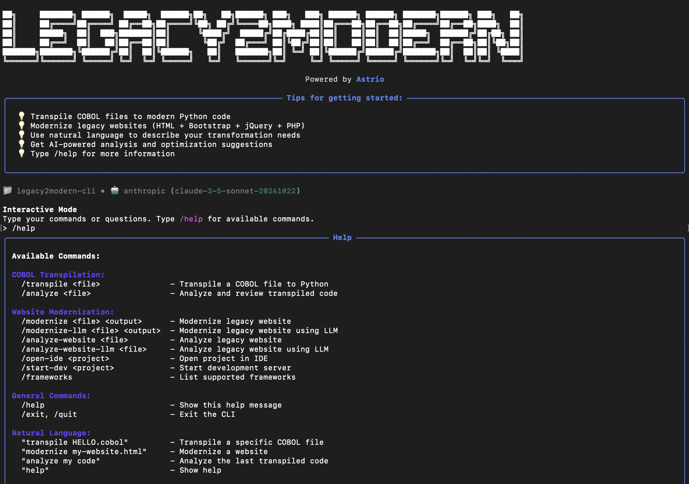

# Legacy2Modern (L2M) — AI Legacy COBOL Transpilation Engine

<div align="center">

<!-- Keep the gap above this line, otherwise they won't render correctly! -->
[](https://github.com/astrio-ai/openlegacy) 
[](https://discord.gg/2BVwAUzW)
[](https://github.com/openrewrite/.github/blob/main/CONTRIBUTING.md)
</div>



Welcome to **Legacy2Modern (L2M)**, an open-source engine for transforming legacy COBOL code into modern, maintainable Python applications.

L2M specializes in **intelligent COBOL transpilation** into modern Python code. It combines the precision of ANTLR4-based parsing with the flexibility of template-driven code generation, augmented by Large Language Models (LLMs) for intelligent analysis and optimization.

Whether you're modernizing COBOL business systems, migrating legacy enterprise applications, or transforming decades-old mainframe code — L2M is built to help you do it **safely**, **accurately**, and **transparently**.

## ✨ Features

* 🔄 **COBOL to Python Transpilation**  
  Translate COBOL programs into modern Python code with multiple transpilation approaches.

* 🖥️ **Modern CLI Interface**  
  Beautiful, interactive command-line interface with natural language commands and AI-powered analysis.

* 🧠 **Lossless Semantic Tree (LST) Parsing**  
  ANTLR4-based parser that retains all source code information including comments, whitespace, and semantic context.

* 🏗️ **Intermediate Representation (IR) System**  
  Language-agnostic IR that enables extensibility to other source and target languages.

* 📝 **Template-Based Code Generation**  
  Jinja2-powered template system for clean, maintainable code generation.

* 🤖 **AI-Powered Analysis & Optimization**  
  LLM integration for code analysis, review, and optimization suggestions with multi-provider support.

* 🎯 **Multiple Transpilation Approaches**  
  - Direct COBOL → Python transpilation
  - IR-based transpilation with templates
  - Hybrid transpilation with LLM augmentation
  - Extensible architecture for future languages

* 🧪 **Comprehensive Testing Framework**  
  Unit tests, integration tests, and validation for all transpilation components.

* 📦 **Easy Installation Options**  
  - PyPI installation: `pip install legacy2modern`
  - Homebrew installation: `brew install legacy2modern`
  - Direct installation: `pip install -e .`
  - Run without installation: `python run_cli.py`

## 🚀 Quickstart

### Prerequisites
- Python 3.10+
- OpenAI or Anthropic API Key

### Installation

```bash
# Clone and install
git clone https://github.com/astrio-ai/legacy2modern.git
cd legacy2modern
pip install -r requirements.txt

# Set API key
export OPENAI_API_KEY="your-api-key-here"
```

### Modernize COBOL to Python

```bash
# Step 1: Modernize a COBOL file
python -m src.cli.cli modernize examples/cobol/HELLO.cobol python

# Step 2: Run the generated code
python output/python/transformed_code.py
```

**Output:**
```
Transformed legacy application starting...
Calling transformed function: hello
HELLO WORLD!
Transformation completed successfully!
```

## 📋 CLI Commands

```bash
# Analyze COBOL structure
python -m src.cli.cli analyze examples/cobol/HELLO.cobol

# Modernize to Python
python -m src.cli.cli modernize examples/cobol/HELLO.cobol python

# With options
python -m src.cli.cli modernize examples/cobol/HELLO.cobol python \
  -o my_output/ -g "maintainability,readability"

# Test generated code
python output/python/transformed_code.py

# Run tests
pytest tests/
```

## ⚙️ Configuration

```bash
# Environment variables
export OPENAI_API_KEY="sk-your-key"
export LLM_PROVIDER="openai"  # or "anthropic"
export LLM_MODEL="gpt-4"
```

## 🐛 Troubleshooting

**No API key**: `export OPENAI_API_KEY="your-key"`  
**Syntax errors**: Check logs with `-v` flag  
**Module errors**: Run `pip install -r requirements.txt`

## 📋 Supported Languages & Frameworks

### **COBOL to Python**
- Variable declarations with PIC clauses
- Level numbers (01, 05, 77)
- Type inference (PIC X → str, PIC 9 → int/float)
- Control flow statements (PERFORM, IF-THEN-ELSE)
- File I/O operations
- Arithmetic operations

### **Legacy Websites to Modern Frameworks**
- **React**: Component-based architecture with hooks
- **Next.js**: Full-stack React framework with SSR
- **Astro**: Content-focused static site generator
- **Bootstrap → Tailwind CSS**: Modern utility-first CSS
- **jQuery → React Hooks**: State management and DOM manipulation
- **PHP → API Routes**: Server-side logic conversion

### **Example Transformations**

**COBOL to Python:**
```cobol
       IDENTIFICATION DIVISION.
       PROGRAM-ID. HELLO.
       PROCEDURE DIVISION.
           DISPLAY 'HELLO WORLD!'.
           GOBACK.
```

**Output:**
```python
# Generated Python code from main

def main():
    print('HELLO WORLD!')
    return

if __name__ == '__main__':
    main()
```

**Legacy HTML to React:**
```html
<div class="container">
  <h1>Welcome</h1>
  <button onclick="showAlert()">Click me</button>
</div>
```

**Output:**
```jsx
import React, { useState } from 'react';

function App() {
  const showAlert = () => {
    alert('Hello!');
  };

  return (
    <div className="container">
      <h1>Welcome</h1>
      <button onClick={showAlert}>Click me</button>
    </div>
  );
}

export default App;
```

## 🔧 Development

### **Project Structure**

```
legacy2modern/
├── engine/                    # Core engine components
│   ├── agents/               # LLM agent system
│   ├── cli/                  # Modern CLI interface
│   └── modernizers/          # Language-specific modernizers
│       ├── cobol_system/     # COBOL transpilation
│       └── static_site/      # Website modernization
├── examples/
│   ├── cobol/               # Sample COBOL programs
│   └── website/             # Sample legacy websites
├── tests/                   # Test suite
├── docs/                    # Documentation
├── scripts/                 # CLI script wrappers
├── output/                  # Generated output files
├── install.sh               # Installation script
├── run_cli.py               # Direct CLI runner
└── setup.py                 # Package configuration
```

### **Adding New Features**

1. **New Language Support**: Add grammar files and IR translators
2. **New Templates**: Create Jinja2 templates for target languages
3. **New Rules**: Implement transformation rules in the modernizers directory
4. **LLM Integration**: Extend agents for AI-powered suggestions
5. **CLI Enhancements**: Add new commands and interactive features
6. **Framework Support**: Add new target frameworks for website modernization

## 🧪 Testing

```bash
# Run all tests
pytest

# Run specific test file
pytest tests/static_site/test_website_modernization.py

# Run with coverage
pytest --cov=engine
```

## 📄 License
This project is licensed under the Apache-2.0 License. See the [LICENSE](./LICENSE) file for details.

## 🤝 Contributing
We welcome all contributions — from fixing typos to adding new language support!
See [CONTRIBUTING.md](./CONTRIBUTING.md) for setup instructions, coding guidelines, and how to submit PRs.

## 💬 Community & Support
* 📢 Follow our project updates on [X](https://x.com/nolan-lwin)
* 👾 Join our [Discord](https://discord.gg/2BVwAUzW)
* 🧑‍💻 Join the discussion: [GitHub Discussions](https://github.com/astrio-ai/legacy2modern/discussions)
* 🧪 Report bugs: [GitHub Issues](https://github.com/astrio-ai/legacy2modern/issues)

## 📬 Contact Us
For partnership inquiries or professional use cases:

📧 **[naingoolwin.astrio@gmail.com](mailto:naingoolwin.astrio@gmail.com)**
