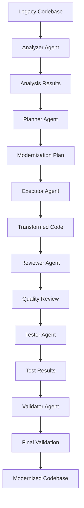

# Legacy2Modern System Architecture

This document describes the comprehensive architecture of the Legacy2Modern multi-agent system for legacy code modernization.

## Overview

Legacy2Modern is a sophisticated multi-agent system built on LangGraph that specializes in analyzing, understanding, and modernizing legacy codebases. The system uses specialized AI agents that work together through orchestrated workflows to transform legacy code into modern equivalents while preserving functionality and improving maintainability.

## System Architecture

### Repository Structure

```
legacy2modern/
├── src/                   # Core multi-agent system
│   ├── core/              # Multi-agent orchestration
│   ├── api/               # FastAPI server
│   ├── cli/               # Command-line interface
│   ├── language_parsers/  # Language-specific parsers
│   ├── modernizers/       # Code transformation engines
│   └── config/            # Configuration management
├── docs/                  # Documentation
├── tests/                 # Test suite
├── examples/              # Example code
├── evals/                 # Evaluation and benchmarking
├── scripts/               # Utility scripts
├── tools/                 # Development tools
├── config/                # Configuration files
├── data/                  # Data storage
└── docker/                # Container configuration
```

## Core Components

### 1. Multi-Agent System (`src/core/`)

The system consists of six specialized agents working in orchestrated workflows:

#### **Analyzer Agent** (`src/core/agents/analyzer_agent.py`)
- **Purpose**: Analyzes legacy codebases to understand structure, dependencies, and functionality
- **Tools**: Code analysis, dependency mapping, complexity assessment
- **Output**: Comprehensive codebase analysis report

#### **Planner Agent** (`src/core/agents/planner_agent.py`)
- **Purpose**: Creates detailed modernization plans based on analysis results
- **Tools**: Risk assessment, strategy planning, resource estimation
- **Output**: Step-by-step modernization roadmap

#### **Executor Agent** (`src/core/agents/executor_agent.py`)
- **Purpose**: Executes code transformations according to the modernization plan
- **Tools**: Code transformation, pattern replacement, structure optimization
- **Output**: Transformed code with backup and rollback capabilities

#### **Reviewer Agent** (`src/core/agents/reviewer_agent.py`)
- **Purpose**: Reviews transformed code for quality and correctness
- **Tools**: Code quality analysis, standards compliance, best practices
- **Output**: Quality assessment and improvement recommendations

#### **Tester Agent** (`src/core/agents/tester_agent.py`)
- **Purpose**: Generates and runs tests to validate functionality preservation
- **Tools**: Test generation, coverage analysis, regression testing
- **Output**: Comprehensive test suite and validation results

#### **Validator Agent** (`src/core/agents/validator_agent.py`)
- **Purpose**: Performs final validation of modernized code
- **Tools**: Integration testing, compliance checking, performance validation
- **Output**: Final validation report and success metrics

### 2. LangGraph Workflows (`src/core/graph/`)

The system uses **LangGraph** to orchestrate agent interactions through specialized workflows:

#### **Main Workflow** (`src/core/graph/main_graph.py`)
- **Purpose**: Complete modernization process with all agents
- **Flow**: Analyzer → Planner → Executor → Reviewer → Tester → Validator
- **State Management**: Comprehensive state tracking across all phases

#### **Legacy Analysis Workflow** (`src/core/graph/legacy_analysis.py`)
- **Purpose**: Focused on code analysis and understanding
- **Flow**: Analyzer Agent only
- **Use Case**: Quick codebase assessment and documentation

#### **Modernization Workflow** (`src/core/graph/modernization.py`)
- **Purpose**: Code transformation and execution
- **Flow**: Planner → Executor → Reviewer
- **Use Case**: Focused code transformation without full testing

#### **Validation Workflow** (`src/core/graph/validation.py`)
- **Purpose**: Testing and quality assurance
- **Flow**: Tester → Validator
- **Use Case**: Post-transformation validation and testing

### 3. Language Parsers (`src/language_parsers/`)

Language-specific parsers for different legacy programming languages:

#### **COBOL Parser** (`src/language_parsers/cobol/`)
- **Technology**: ANTLR4-based parser with comprehensive grammar
- **Features**: Full COBOL85 support, preprocessor handling, AST generation
- **Output**: Structured intermediate representation (IR)

#### **FORTRAN Parser** (`src/language_parsers/fortran/`)
- **Technology**: Custom parser for FORTRAN variants
- **Features**: Legacy FORTRAN support, modern FORTRAN compatibility
- **Output**: Structured intermediate representation

#### **Pascal Parser** (`src/language_parsers/pascal/`)
- **Technology**: Custom parser for Pascal variants
- **Features**: Object Pascal support, legacy Pascal compatibility
- **Output**: Structured intermediate representation

#### **Assembly Parser** (`src/language_parsers/assembly/`)
- **Technology**: Architecture-specific parsers
- **Features**: Multiple assembly dialects, instruction analysis
- **Output**: Structured intermediate representation

### 4. Modernizers (`src/modernizers/`)

Language-specific modernizers for transforming legacy code:

#### **COBOL Modernizers**
- **COBOL to Python** (`src/modernizers/cobol_to_python.py`): Transforms COBOL to modern Python
- **COBOL to Java** (`src/modernizers/cobol_to_java.py`): Transforms COBOL to Java
- **COBOL to C#** (`src/modernizers/cobol_to_csharp.py`): Transforms COBOL to C#

#### **FORTRAN Modernizers**
- **FORTRAN to Python** (`src/modernizers/fortran_to_python.py`): Transforms FORTRAN to Python

#### **Pascal Modernizers**
- **Pascal to C#** (`src/modernizers/pascal_to_csharp.py`): Transforms Pascal to C#

#### **Assembly Modernizers**
- **Assembly to C** (`src/modernizers/assembly_to_c.py`): Transforms Assembly to C

## 🔄 Data Flow & Workflows

### Main Data Flow



### Workflow Orchestration

1. **Input Processing**: Legacy codebase is analyzed by the Analyzer Agent
2. **Planning Phase**: Planner Agent creates a modernization plan
3. **Execution Phase**: Executor Agent transforms code according to the plan
4. **Review Phase**: Reviewer Agent reviews transformed code
5. **Testing Phase**: Tester Agent generates and runs tests
6. **Validation Phase**: Validator Agent performs final validation

## State Management (`src/core/state/`)

The system uses **LangGraph state management** to track:

### Graph State (`src/core/state/graph_state.py`)
- **Input Parameters**: Codebase path, target language, modernization goals
- **Analysis Results**: Code structure, dependencies, complexity metrics
- **Planning Results**: Modernization plan, risk assessment, strategy
- **Execution Results**: Transformation results, pattern applications
- **Review Results**: Quality scores, standards compliance, issues
- **Test Results**: Test coverage, pass/fail rates, performance metrics
- **Validation Results**: Final validation status, success metrics

### Agent State (`src/core/state/agent_state.py`)
- **Agent Identity**: Agent ID, type, and configuration
- **Current Context**: Active codebase, target language, goals
- **Memory State**: Previous results, learned patterns, context
- **Error State**: Error handling, retry logic, fallback strategies

## Memory Management (`src/core/memory/`)

The system maintains several types of memory:

### Conversation Memory (`src/core/memory/conversation.py`)
- **Purpose**: Tracks agent interactions and decisions
- **Content**: Message history, decision rationale, context
- **Persistence**: Session-based and long-term storage

### Codebase Context (`src/core/memory/codebase_context.py`)
- **Purpose**: Maintains codebase metadata and analysis results
- **Content**: File structure, dependencies, complexity metrics
- **Persistence**: Project-specific and version-controlled

### Knowledge Base (`src/core/memory/knowledge_base.py`)
- **Purpose**: Stores patterns, rules, and best practices
- **Content**: Transformation patterns, quality standards, best practices
- **Persistence**: System-wide and continuously updated

## Tools & Utilities (`src/core/tools/`)

### Code Tools (`src/core/tools/code_tools.py`)
- **CodeAnalyzerTool**: Code structure analysis
- **DependencyAnalyzerTool**: Dependency mapping
- **PatternReplacerTool**: Pattern-based transformations
- **CodeTransformerTool**: Code transformation execution
- **QualityAnalyzerTool**: Code quality assessment
- **CodeReviewTool**: Code review and validation

### File Tools (`src/core/tools/file_tools.py`)
- **FileReaderTool**: File reading and parsing
- **FileWriterTool**: File writing and generation
- **DirectoryScannerTool**: Directory scanning and discovery
- **BackupTool**: Backup creation and management

### Test Tools (`src/core/tools/test_tools.py`)
- **TestGeneratorTool**: Test case generation
- **TestRunnerTool**: Test execution and reporting
- **CoverageAnalyzerTool**: Test coverage analysis
- **IntegrationTestTool**: Integration testing

### Search Tools (`src/core/tools/search_tools.py`)
- **PatternSearchTool**: Code pattern searching
- **ReferenceFinderTool**: Reference and dependency finding
- **CodeDiscoveryTool**: Code structure discovery

## API Layer (`src/api/`)

### FastAPI Server (`src/api/server.py`)
- **RESTful API**: Complete REST API for all operations
- **WebSocket Support**: Real-time updates and streaming
- **Authentication**: JWT-based authentication
- **Rate Limiting**: Request rate limiting and throttling

### API Routes (`src/api/routes/`)
- **Agents API** (`src/api/routes/agents.py`): Agent management endpoints
- **Workflows API** (`src/api/routes/workflows.py`): Workflow execution endpoints
- **Analysis API** (`src/api/routes/analysis.py`): Code analysis endpoints
- **Modernization API** (`src/api/routes/modernization.py`): Code transformation endpoints

### Middleware (`src/api/middleware/`)
- **Authentication** (`src/api/middleware/auth.py`): JWT authentication
- **Rate Limiting** (`src/api/middleware/rate_limit.py`): Request throttling
- **Logging** (`src/api/middleware/logging.py`): Request/response logging

## CLI Interface (`src/cli/`)

### Main CLI (`src/cli/cli.py`)
- **Beautiful Banner**: ASCII art banner with branding
- **Rich Console**: Professional console output with colors
- **Command Structure**: Organized command hierarchy

### CLI Commands (`src/cli/commands/`)
- **Analyze** (`src/cli/commands/analyze.py`): Code analysis commands
- **Modernize** (`src/cli/commands/modernize.py`): Code transformation commands
- **Test** (`src/cli/commands/test.py`): Testing commands
- **Validate** (`src/cli/commands/validate.py`): Validation commands

## Configuration (`src/config/`)

### Settings (`src/config/settings.py`)
- **Application Settings**: App name, version, debug mode
- **API Settings**: Host, port, authentication
- **LLM Settings**: Provider, model, API keys
- **Agent Settings**: Timeouts, retry counts, parallel limits
- **Workflow Settings**: Execution timeouts, retry logic

### Agent Configuration (`src/config/agents.py`)
- **Individual Agent Settings**: Per-agent configuration
- **Tool Configuration**: Tool-specific settings
- **Memory Configuration**: Memory management settings

### Model Configuration (`src/config/models.py`)
- **LLM Provider Settings**: OpenAI, Anthropic, local models
- **Model Parameters**: Temperature, max tokens, context windows
- **API Configuration**: API keys, endpoints, rate limits

## Deployment (`docker/`)

### Docker Configuration
- **Dockerfile**: Multi-stage build for production
- **docker-compose.yml**: Development environment
- **docker-compose.prod.yml**: Production environment

### Container Features
- **Multi-stage Build**: Optimized production images
- **Health Checks**: Container health monitoring
- **Volume Mounts**: Persistent data storage
- **Environment Variables**: Configuration management

## Testing (`tests/`)

### Test Structure
- **Unit Tests** (`tests/unit/`): Individual component testing
- **Integration Tests** (`tests/integration/`): Component integration testing
- **End-to-End Tests** (`tests/e2e/`): Complete workflow testing

### Test Coverage
- **Agent Testing**: Individual agent functionality
- **Workflow Testing**: LangGraph workflow execution
- **API Testing**: REST API endpoint testing
- **CLI Testing**: Command-line interface testing

## Evaluation & Benchmarking (`evals/`)

### Evaluation System
The evaluation system provides comprehensive testing and benchmarking capabilities for the multi-agent system.

#### **Benchmarks** (`evals/benchmarks/`)
- **Agent Benchmarks** (`evals/benchmarks/agent_benchmarks.py`): Individual agent performance evaluation
- **Workflow Benchmarks** (`evals/benchmarks/workflow_benchmarks.py`): End-to-end workflow performance testing
- **Quality Benchmarks**: Code quality and transformation accuracy assessment

#### **Datasets** (`evals/datasets/`)
- **Test Cases**: Curated test cases for evaluation
- **Benchmark Data**: Standardized datasets for consistent evaluation
- **Reference Implementations**: Ground truth for accuracy comparison

#### **Metrics** (`evals/metrics/`)
- **Performance Metrics**: Speed, resource utilization, and efficiency
- **Accuracy Metrics**: Transformation correctness and fidelity
- **Quality Metrics**: Code quality scores and standards compliance
- **Coverage Metrics**: Test coverage and validation completeness

#### **Reports** (`evals/reports/`)
- **Evaluation Reports**: Comprehensive evaluation results
- **Performance Reports**: System performance analysis
- **Quality Reports**: Code quality assessment results
- **Trend Analysis**: Performance trends over time

#### **Scripts** (`evals/scripts/`)
- **Run All Evaluations** (`evals/scripts/run_all_evals.py`): Comprehensive evaluation runner
- **Agent Evaluations**: Individual agent performance testing
- **Workflow Evaluations**: Workflow performance testing
- **Quality Evaluations**: Code quality assessment

### Evaluation Metrics

#### **Performance Metrics**
- **Execution Time**: Average time for agent and workflow execution
- **Resource Utilization**: CPU, memory, and I/O usage
- **Throughput**: Number of operations per unit time
- **Scalability**: Performance under different load conditions

#### **Accuracy Metrics**
- **Transformation Accuracy**: Correctness of legacy-to-modern code transformation
- **Functionality Preservation**: Preservation of original functionality
- **Semantic Equivalence**: Semantic correctness of transformed code
- **Regression Testing**: Validation of functionality preservation

#### **Quality Metrics**
- **Code Quality Scores**: Automated code quality assessment
- **Standards Compliance**: Adherence to coding standards
- **Best Practices**: Implementation of modern best practices
- **Maintainability**: Code maintainability and readability

#### **Coverage Metrics**
- **Test Coverage**: Percentage of code covered by tests
- **Validation Coverage**: Completeness of validation processes
- **Error Coverage**: Coverage of error scenarios and edge cases
- **Integration Coverage**: End-to-end workflow coverage

## Monitoring & Logging

### Logging (`src/utils/logger.py`)
- **Structured Logging**: JSON-formatted logs
- **Log Levels**: DEBUG, INFO, WARNING, ERROR, CRITICAL
- **Log Rotation**: Automatic log file rotation
- **Log Aggregation**: Centralized log collection

### Error Handling (`src/utils/errors.py`)
- **Custom Exceptions**: Domain-specific error types
- **Error Recovery**: Automatic retry and fallback mechanisms
- **Error Reporting**: Comprehensive error reporting and tracking

## Security

### Authentication & Authorization
- **JWT Tokens**: Secure authentication
- **API Keys**: Service-to-service authentication
- **Role-based Access**: Granular permission control

### Data Protection
- **Input Validation**: Comprehensive input sanitization
- **Output Sanitization**: Safe output generation
- **Secure Storage**: Encrypted data storage
- **Audit Logging**: Security event logging

## Performance & Scalability

### Performance Optimization
- **Async Operations**: Asynchronous processing
- **Caching**: Intelligent caching strategies
- **Resource Management**: Efficient resource utilization
- **Parallel Processing**: Multi-agent parallel execution

### Scalability Features
- **Horizontal Scaling**: Multi-instance deployment
- **Load Balancing**: Request distribution
- **Queue Management**: Task queue processing
- **Resource Monitoring**: Performance monitoring and alerting