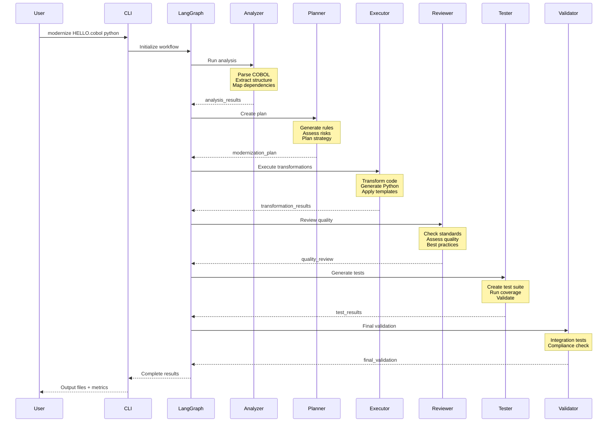
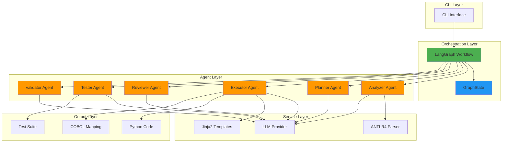
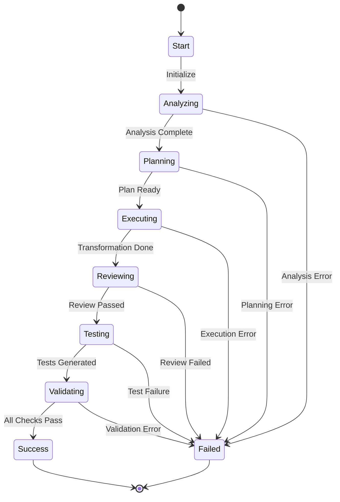
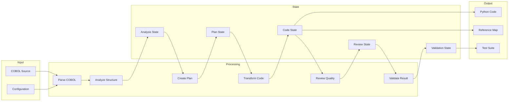

# Workflow Diagrams

## Sequence Diagram: Main Workflow Execution

```mermaid
sequenceDiagram
    participant User
    participant CLI
    participant LangGraph
    participant Analyzer
    participant Planner
    participant Executor
    participant Reviewer
    participant Tester
    participant Validator

    User->>CLI: modernize HELLO.cobol python
    CLI->>LangGraph: Initialize workflow
    LangGraph->>Analyzer: Run analysis
    
    Note over Analyzer: Parse COBOL<br/>Extract structure<br/>Map dependencies
    
    Analyzer-->>LangGraph: analysis_results
    LangGraph->>Planner: Create plan
    
    Note over Planner: Generate rules<br/>Assess risks<br/>Plan strategy
    
    Planner-->>LangGraph: modernization_plan
    LangGraph->>Executor: Execute transformations
    
    Note over Executor: Transform code<br/>Generate Python<br/>Apply templates
    
    Executor-->>LangGraph: transformation_results
    LangGraph->>Reviewer: Review quality
    
    Note over Reviewer: Check standards<br/>Assess quality<br/>Best practices
    
    Reviewer-->>LangGraph: quality_review
    LangGraph->>Tester: Generate tests
    
    Note over Tester: Create test suite<br/>Run coverage<br/>Validate
    
    Tester-->>LangGraph: test_results
    LangGraph->>Validator: Final validation
    
    Note over Validator: Integration tests<br/>Compliance check
    
    Validator-->>LangGraph: final_validation
    LangGraph-->>CLI: Complete results
    CLI-->>User: Output files + metrics
```

## Component Diagram: System Architecture

```mermaid
graph TB
    subgraph "CLI Layer"
        CLI[CLI Interface]
    end
    
    subgraph "Orchestration Layer"
        LG[LangGraph Workflow]
        GS[GraphState]
    end
    
    subgraph "Agent Layer"
        A[Analyzer Agent]
        P[Planner Agent]
        E[Executor Agent]
        R[Reviewer Agent]
        T[Tester Agent]
        V[Validator Agent]
    end
    
    subgraph "Service Layer"
        LLM[LLM Provider]
        Parser[ANTLR4 Parser]
        Template[Jinja2 Templates]
    end
    
    subgraph "Output Layer"
        Python[Python Code]
        Mapping[COBOL Mapping]
        Tests[Test Suite]
    end
    
    CLI --> LG
    LG --> GS
    LG --> A
    LG --> P
    LG --> E
    LG --> R
    LG --> T
    LG --> V
    
    A --> Parser
    A --> LLM
    P --> LLM
    E --> LLM
    E --> Template
    R --> LLM
    T --> LLM
    V --> LLM
    
    E --> Python
    E --> Mapping
    T --> Tests
    
    style LG fill:#4CAF50
    style GS fill:#2196F3
    style A fill:#FF9800
    style P fill:#FF9800
    style E fill:#FF9800
    style R fill:#FF9800
    style T fill:#FF9800
    style V fill:#FF9800
```

## State Transition Diagram

```mermaid
stateDiagram-v2
    [*] --> Start
    
    Start --> Analyzing: Initialize
    Analyzing --> Planning: Analysis Complete
    Planning --> Executing: Plan Ready
    Executing --> Reviewing: Transformation Done
    Reviewing --> Testing: Review Passed
    Testing --> Validating: Tests Generated
    Validating --> Success: All Checks Pass
    Validating --> Failed: Validation Error
    
    Analyzing --> Failed: Analysis Error
    Planning --> Failed: Planning Error
    Executing --> Failed: Execution Error
    Reviewing --> Failed: Review Failed
    Testing --> Failed: Test Failure
    
    Failed --> [*]
    Success --> [*]
```

## Data Flow Diagram

```mermaid
graph LR
    subgraph "Input"
        COBOL[COBOL Source]
        Config[Configuration]
    end
    
    subgraph "Processing"
        Parse[Parse COBOL]
        Analyze[Analyze Structure]
        Plan[Create Plan]
        Transform[Transform Code]
        Review[Review Quality]
        Validate[Validate Result]
    end
    
    subgraph "State"
        S1[Analysis State]
        S2[Plan State]
        S3[Code State]
        S4[Review State]
        S5[Validation State]
    end
    
    subgraph "Output"
        PyCode[Python Code]
        Ref[Reference Map]
        Suite[Test Suite]
    end
    
    COBOL --> Parse
    Config --> Parse
    Parse --> Analyze
    Analyze --> S1
    S1 --> Plan
    Plan --> S2
    S2 --> Transform
    Transform --> S3
    S3 --> Review
    Review --> S4
    S4 --> Validate
    Validate --> S5
    
    S3 --> PyCode
    S3 --> Ref
    S5 --> Suite
```

