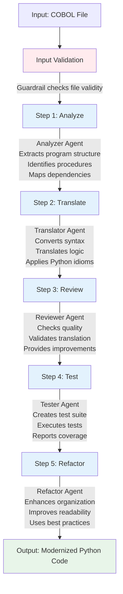
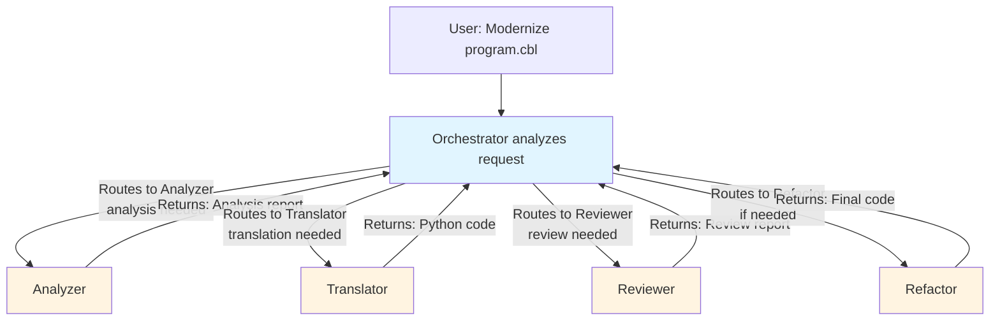

# Workflow Documentation

## Overview

The modernization workflow transforms COBOL code into modern Python through a series of coordinated steps executed by specialized agents.

## Workflow Diagram



## Sequential Workflow

The **sequential workflow** executes agents in a fixed order:

### Step 1: Analysis

**Agent**: Analyzer Agent  
**Input**: COBOL file path  
**Process**:
1. Read COBOL file content
2. Parse structure using COBOL parser tool
3. Extract variables, procedures, and dependencies
4. Generate analysis report

**Output**: Structured analysis report

```python
analysis = await analyzer.run(
    f"Analyze this COBOL program:\n\n{cobol_content}"
)
```

### Step 2: Translation

**Agent**: Translator Agent  
**Input**: COBOL code + Analysis report  
**Process**:
1. Receive COBOL code and analysis
2. Map COBOL constructs to Python equivalents
3. Translate control flow
4. Apply Python best practices

**Output**: Python code equivalent

```python
translation = await translator.run(
    f"Translate this COBOL code to Python:\n\n{cobol_content}\n\nAnalysis: {analysis}"
)
```

### Step 3: Review

**Agent**: Reviewer Agent  
**Input**: Translated Python code  
**Process**:
1. Review code quality
2. Check correctness
3. Identify issues
4. Suggest improvements

**Output**: Review report with suggestions

```python
review = await reviewer.run(
    f"Review this Python code:\n\n{translation}"
)
```

### Step 4: Testing

**Agent**: Tester Agent  
**Input**: Python code  
**Process**:
1. Generate unit tests
2. Execute tests
3. Report results

**Output**: Test suite and execution results

```python
tests = await tester.run(
    f"Generate and run tests for this Python code:\n\n{translation}"
)
```

### Step 5: Refactoring

**Agent**: Refactor Agent  
**Input**: Python code + Review suggestions  
**Process**:
1. Apply review suggestions
2. Improve structure
3. Optimize code
4. Enhance readability

**Output**: Refactored Python code

```python
refactored = await refactor.run(
    f"Refactor this Python code based on review:\n\n{translation}\n\nReview: {review}"
)
```

## Handoff Workflow

The **handoff workflow** uses an orchestrator agent to dynamically route tasks:

### Orchestrator Decision Making

The orchestrator agent:
1. Receives modernization request
2. Decides which agents to use
3. Routes tasks to appropriate agents
4. Coordinates handoffs
5. Collects results

### Dynamic Routing



## Usage Examples

### Sequential Mode

```python
from src.workflows.modernization_pipeline import ModernizationPipeline

# Create pipeline without handoffs
pipeline = ModernizationPipeline(use_handoffs=False)

# Run modernization
results = await pipeline.run("data/samples/sample1.cbl")

# Access results
print(results["analysis"])
print(results["translation"])
print(results["review"])
print(results["tests"])
print(results["refactored"])
```

### Handoff Mode

```python
from src.workflows.modernization_pipeline import ModernizationPipeline

# Create pipeline with handoffs (default)
pipeline = ModernizationPipeline(use_handoffs=True)

# Run modernization
results = await pipeline.run("data/samples/sample1.cbl")

# Orchestrator handles routing automatically
print(results["orchestrator_output"])
```

### Custom Session

```python
# Use custom session ID for conversation history
pipeline = ModernizationPipeline(
    session_id="my_session_123",
    use_handoffs=False
)

results = await pipeline.run("data/samples/sample1.cbl")
```

## Workflow Configuration

### Settings

Configure workflow behavior via settings:

```python
from src.config import get_settings

settings = get_settings()

# Available settings:
settings.openai_model          # Model to use (default: "gpt-4o")
settings.openai_temperature     # Temperature (default: 0.7)
settings.max_turns             # Max agent turns (default: 50)
settings.db_path               # Session database path
```

### Environment Variables

Set in `.env` file:

```bash
OPENAI_API_KEY=sk-...
OPENAI_MODEL=gpt-4o
OPENAI_TEMPERATURE=0.7
MAX_TURNS=50
```

## Error Handling

The workflow handles errors at multiple levels:

1. **Input Validation**: Guardrails check file before processing
2. **Agent Errors**: Each agent handles errors gracefully
3. **Pipeline Errors**: Pipeline catches and reports errors
4. **Output Validation**: Guardrails validate generated code

**Error Response Format**:
```python
results = {
    "cobol_file": "file.cbl",
    "analysis": "...",
    "translation": "...",
    "error": "Error message if any"
}
```

## Performance Considerations

### Sequential Mode
- **Pros**: Predictable, easier to debug
- **Cons**: Slower (sequential execution)

### Handoff Mode
- **Pros**: Faster (parallel where possible), intelligent routing
- **Cons**: More complex, harder to debug

### Optimization Tips

1. **Use Sessions**: Reuse sessions for related files
2. **Batch Processing**: Process multiple files efficiently with batch pipeline
3. **Caching**: Cache analysis results for similar files
4. **Model Selection**: Use faster models for simple tasks

## Batch Processing

The batch processing workflow allows you to modernize multiple COBOL files efficiently with real-time progress tracking and comprehensive reporting.

### Batch Pipeline

The `BatchModernizationPipeline` processes multiple files sequentially with configurable delays to avoid API rate limits:

```python
from src.workflows.batch_pipeline import BatchModernizationPipeline, discover_cobol_files
from src.config import get_settings

# Discover COBOL files
cobol_files = discover_cobol_files("data/aws-samples/")

# Create batch pipeline
settings = get_settings()
settings.batch_file_delay_seconds = 10.0  # 10 second delay between files
batch_pipeline = BatchModernizationPipeline(settings)

# Process all files
batch_result = await batch_pipeline.run_batch(cobol_files)
```

### File Discovery

Discover COBOL files from various sources:

```python
from src.workflows.batch_pipeline import discover_cobol_files

# From directory (recursive)
files = discover_cobol_files("data/aws-samples/")

# With glob pattern
files = discover_cobol_files(".", pattern="**/*.cbl")

# From file list
files = discover_cobol_files("file_list.txt")  # One path per line
```

### CLI Batch Processing

Use the CLI for batch processing:

```bash
# Process directory
python -m src.main --directory data/aws-samples/ --batch-delay 10.0

# Process multiple files
python -m src.main file1.cbl file2.cbl file3.cbl

# Process with pattern
python -m src.main --pattern "**/*.cbl"

# Process from file list
python -m src.main --file-list files.txt
```

### Batch Configuration

Configure batch processing via settings:

```python
from src.config import get_settings

settings = get_settings()

# Batch settings
settings.batch_file_delay_seconds = 10.0  # Delay between files (default: 5.0s)
settings.batch_max_concurrent = 1        # Max parallel files (default: 1)
settings.batch_continue_on_error = True   # Continue on error (default: True)
settings.batch_retry_failed = False       # Retry failed files (default: False)
```

Or via environment variables in `.env`:

```bash
BATCH_FILE_DELAY_SECONDS=10.0
BATCH_MAX_CONCURRENT=1
BATCH_CONTINUE_ON_ERROR=true
```

### Progress Tracking

The batch pipeline provides real-time progress updates:

- **Progress Bar**: Visual progress indicator `[████████░░░░░░░░] 20% (3/15)`
- **ETA**: Estimated time remaining based on average processing time
- **Current Step**: Shows which pipeline step is running (Analyzing, Translating, etc.)
- **File Info**: Current file name and line count

Example output:
```
[████████░░░░░░░░] 20% (3/15) | ETA: 45 minutes | [3/15] Processing COACTUPC.cbl (4237 lines)... Translating...
```

### Batch Results

Access batch processing results:

```python
batch_result = await batch_pipeline.run_batch(cobol_files)

# Summary statistics
print(f"Total files: {batch_result.total_files}")
print(f"Successful: {batch_result.successful}")
print(f"Failed: {batch_result.failed}")
print(f"Duration: {batch_result.total_duration_seconds}s")

# Individual file results
for result in batch_result.results:
    if result.success:
        print(f"✓ {result.file_path.name}: {result.duration_seconds:.1f}s")
        print(f"  Output: {result.output_file}")
        print(f"  Test: {result.test_file}")
    else:
        print(f"✗ {result.file_path.name}: {result.error}")
```

### Batch Reports

The batch pipeline automatically generates JSON reports:

```json
{
  "batch_info": {
    "start_time": "2025-11-07T01:08:16",
    "end_time": "2025-11-07T03:23:46",
    "total_duration_seconds": 8130.0,
    "total_files": 15,
    "successful": 12,
    "failed": 3
  },
  "configuration": {
    "batch_file_delay_seconds": 10.0,
    "batch_max_concurrent": 1,
    "batch_continue_on_error": true
  },
  "results": [...]
}
```

Reports are saved to `data/output/batch_report_YYYYMMDD_HHMMSS.json`.

### Error Handling

Batch processing handles errors gracefully:

- **Continue on Error**: By default, processing continues even if a file fails
- **Error Tracking**: All errors are recorded in the batch result
- **Summary Report**: Failed files are listed in the console summary

To stop on first error:

```bash
python -m src.main --directory data/aws-samples/ --no-continue-on-error
```

### Rate Limiting

Batch processing includes built-in rate limiting:

- **Inter-file Delays**: Configurable delay between files (default: 5.0s)
- **Exponential Backoff**: Automatic retry with backoff on rate limit errors
- **Agent Delays**: Additional delays between agent calls within each file

Recommended settings for large batches:

```bash
# Conservative settings for large codebases
BATCH_FILE_DELAY_SECONDS=10.0
AGENT_DELAY_SECONDS=3.0
OPENAI_MODEL=gpt-4o-mini
```

## Extending the Workflow

### Add Custom Steps

```python
class CustomPipeline(ModernizationPipeline):
    async def run(self, cobol_file_path: str):
        results = await super().run(cobol_file_path)
        
        # Add custom step
        custom_result = await self.custom_step(results)
        results["custom"] = custom_result
        
        return results
```

### Custom Agent Integration

```python
# Add new agent to workflow
pipeline = ModernizationPipeline()
pipeline.custom_agent = CustomAgent()

# Use in sequential workflow
custom_result = await pipeline.custom_agent.run("...")
```

## Interactive CLI Workflow

The `l2m` command wraps all workflows into an interactive REPL. It keeps context between commands, streams progress as you modernize programs, and exposes quick shortcuts for common tasks.

### Launching the Shell

```bash
pip install -e .
l2m
```

### Core Commands

| Command | Description |
| --- | --- |
| `modernize <file.cbl>` | Runs the full modernization pipeline and prints a concise summary. |
| `batch --directory DIR [--pattern PATTERN]` | Orchestrates batch processing with live progress bar, ETA, and summary. |
| `evaluate [--save]` | Executes the evaluator and displays CodeGen-style metrics; optionally saves the report. |
| `inspect <path>` | Previews COBOL or Python files directly inside the shell. |
| `diff <file_a> <file_b>` | Shows a unified diff, helpful for comparing generated code vs. ground truth. |
| `history`, `save_session`, `load_session` | Manage session history across CLI runs. |
| `config [--refresh]` | Displays active configuration (model, rate limits, batch settings). |

### Natural Language Prompts

The shell also accepts light natural language queries. For example, typing `modernize the file data/hello/HELLO.cbl` will trigger the same modernization as the explicit command.

### When to Use It

- **Exploration**: Inspect COBOL/Python pairs, run quick diffs, and review evaluator output.
- **Iterative modernization**: Move between modernization, inspection, and evaluation without leaving the REPL.
- **Session handoff**: Save your progress with `save_session state.json` and resume later with `load_session state.json`.

For large automated runs, the non-interactive CLI (`python -m src.main ...`) and batch APIs remain the best fit. The interactive shell complements them with an operator-friendly, conversational interface.

