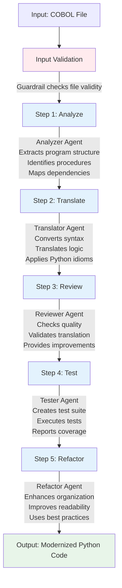
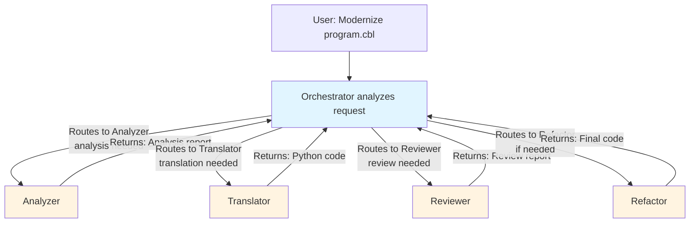

# Workflow Documentation

## Overview

The modernization workflow transforms COBOL code into modern Python through a series of coordinated steps executed by specialized agents.

## Workflow Diagram



## Sequential Workflow

The **sequential workflow** executes agents in a fixed order:

### Step 1: Analysis

**Agent**: Analyzer Agent  
**Input**: COBOL file path  
**Process**:
1. Read COBOL file content
2. Parse structure using COBOL parser tool
3. Extract variables, procedures, and dependencies
4. Generate analysis report

**Output**: Structured analysis report

```python
analysis = await analyzer.run(
    f"Analyze this COBOL program:\n\n{cobol_content}"
)
```

### Step 2: Translation

**Agent**: Translator Agent  
**Input**: COBOL code + Analysis report  
**Process**:
1. Receive COBOL code and analysis
2. Map COBOL constructs to Python equivalents
3. Translate control flow
4. Apply Python best practices

**Output**: Python code equivalent

```python
translation = await translator.run(
    f"Translate this COBOL code to Python:\n\n{cobol_content}\n\nAnalysis: {analysis}"
)
```

### Step 3: Review

**Agent**: Reviewer Agent  
**Input**: Translated Python code  
**Process**:
1. Review code quality
2. Check correctness
3. Identify issues
4. Suggest improvements

**Output**: Review report with suggestions

```python
review = await reviewer.run(
    f"Review this Python code:\n\n{translation}"
)
```

### Step 4: Testing

**Agent**: Tester Agent  
**Input**: Python code  
**Process**:
1. Generate unit tests
2. Execute tests
3. Report results

**Output**: Test suite and execution results

```python
tests = await tester.run(
    f"Generate and run tests for this Python code:\n\n{translation}"
)
```

### Step 5: Refactoring

**Agent**: Refactor Agent  
**Input**: Python code + Review suggestions  
**Process**:
1. Apply review suggestions
2. Improve structure
3. Optimize code
4. Enhance readability

**Output**: Refactored Python code

```python
refactored = await refactor.run(
    f"Refactor this Python code based on review:\n\n{translation}\n\nReview: {review}"
)
```

## Handoff Workflow

The **handoff workflow** uses an orchestrator agent to dynamically route tasks:

### Orchestrator Decision Making

The orchestrator agent:
1. Receives modernization request
2. Decides which agents to use
3. Routes tasks to appropriate agents
4. Coordinates handoffs
5. Collects results

### Dynamic Routing



## Usage Examples

### Sequential Mode

```python
from src.workflows.modernization_pipeline import ModernizationPipeline

# Create pipeline without handoffs
pipeline = ModernizationPipeline(use_handoffs=False)

# Run modernization
results = await pipeline.run("data/samples/sample1.cbl")

# Access results
print(results["analysis"])
print(results["translation"])
print(results["review"])
print(results["tests"])
print(results["refactored"])
```

### Handoff Mode

```python
from src.workflows.modernization_pipeline import ModernizationPipeline

# Create pipeline with handoffs (default)
pipeline = ModernizationPipeline(use_handoffs=True)

# Run modernization
results = await pipeline.run("data/samples/sample1.cbl")

# Orchestrator handles routing automatically
print(results["orchestrator_output"])
```

### Custom Session

```python
# Use custom session ID for conversation history
pipeline = ModernizationPipeline(
    session_id="my_session_123",
    use_handoffs=False
)

results = await pipeline.run("data/samples/sample1.cbl")
```

## Workflow Configuration

### Settings

Configure workflow behavior via settings:

```python
from src.config import get_settings

settings = get_settings()

# Available settings:
settings.openai_model          # Model to use (default: "gpt-4o")
settings.openai_temperature     # Temperature (default: 0.7)
settings.max_turns             # Max agent turns (default: 50)
settings.db_path               # Session database path
```

### Environment Variables

Set in `.env` file:

```bash
OPENAI_API_KEY=sk-...
OPENAI_MODEL=gpt-4o
OPENAI_TEMPERATURE=0.7
MAX_TURNS=50
```

## Error Handling

The workflow handles errors at multiple levels:

1. **Input Validation**: Guardrails check file before processing
2. **Agent Errors**: Each agent handles errors gracefully
3. **Pipeline Errors**: Pipeline catches and reports errors
4. **Output Validation**: Guardrails validate generated code

**Error Response Format**:
```python
results = {
    "cobol_file": "file.cbl",
    "analysis": "...",
    "translation": "...",
    "error": "Error message if any"
}
```

## Performance Considerations

### Sequential Mode
- **Pros**: Predictable, easier to debug
- **Cons**: Slower (sequential execution)

### Handoff Mode
- **Pros**: Faster (parallel where possible), intelligent routing
- **Cons**: More complex, harder to debug

### Optimization Tips

1. **Use Sessions**: Reuse sessions for related files
2. **Batch Processing**: Process multiple files in one session
3. **Caching**: Cache analysis results for similar files
4. **Model Selection**: Use faster models for simple tasks

## Extending the Workflow

### Add Custom Steps

```python
class CustomPipeline(ModernizationPipeline):
    async def run(self, cobol_file_path: str):
        results = await super().run(cobol_file_path)
        
        # Add custom step
        custom_result = await self.custom_step(results)
        results["custom"] = custom_result
        
        return results
```

### Custom Agent Integration

```python
# Add new agent to workflow
pipeline = ModernizationPipeline()
pipeline.custom_agent = CustomAgent()

# Use in sequential workflow
custom_result = await pipeline.custom_agent.run("...")
```

